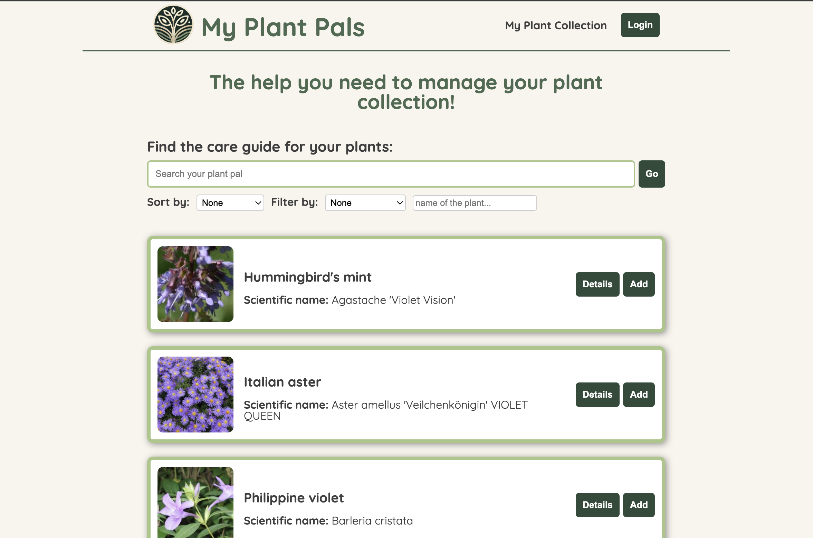
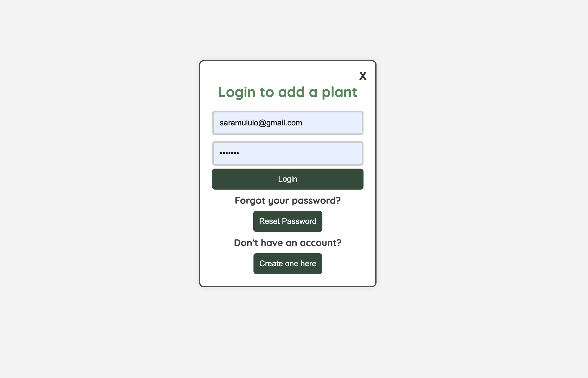

# PlantPals Web App

Responsive web app that helps users manage their plant collections with personalized dashboards and dynamic plant care information.

---

## Features
- User authentication with Firebase  
- Manage plant collections with Firestore  
- Fetch and display plant care data from a REST API  
- Responsive design for desktop and mobile  
- Modular React.js components for scalability and maintainability  

---

## Technologies
React.js, CSS3, Firebase (Auth & Firestore), RESTful APIs

---

## Installation
1. Clone the repository:
   git clone https://github.com/saraccmululo/plant-pals-web-app.git
   cd plant-pals-web-app
2. Install dependencies:
    npm install
3. Start the development server:
    npm run dev
    Open your browser at the URL shown in the terminal

Usage
Sign in to access your personalized plant dashboard
View, add, and manage plants in your collection
Fetch and explore plant care information dynamically
